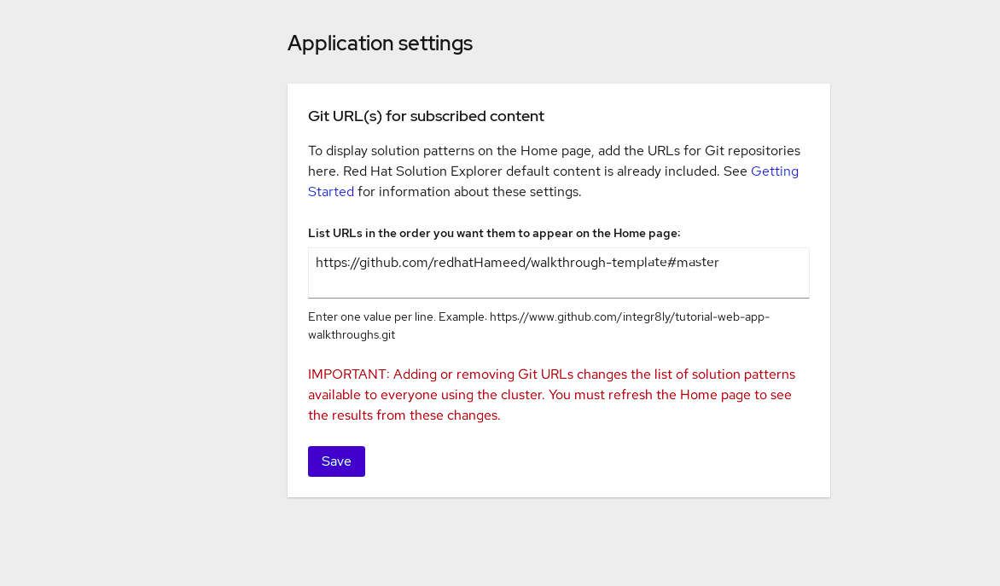

# Walkthrough Solution Explorer

Add WalkThorough

* Navigate to the Solution Explorer.
* Click the gear icon in the top right to display the Application settings screen.
* Enter the URLs of the Solution Pattern repositories add to your cluster
* Click Save.
* Refresh your browser.

`` NOTE: Enter one URL per line. To include a specific branch, use the syntax #<branch-name>.
List URLs in the order you want them to appear on the homepage. ``

 
