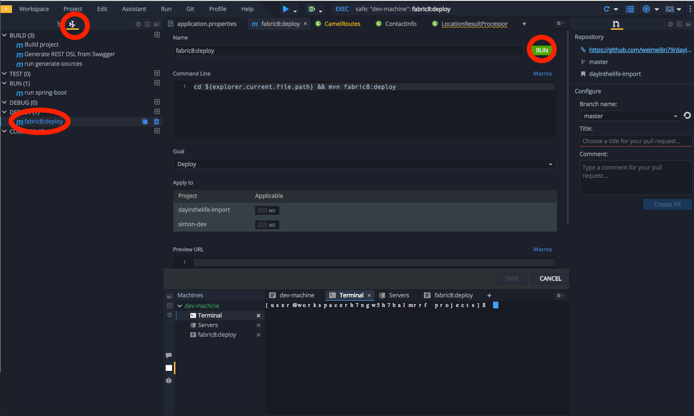
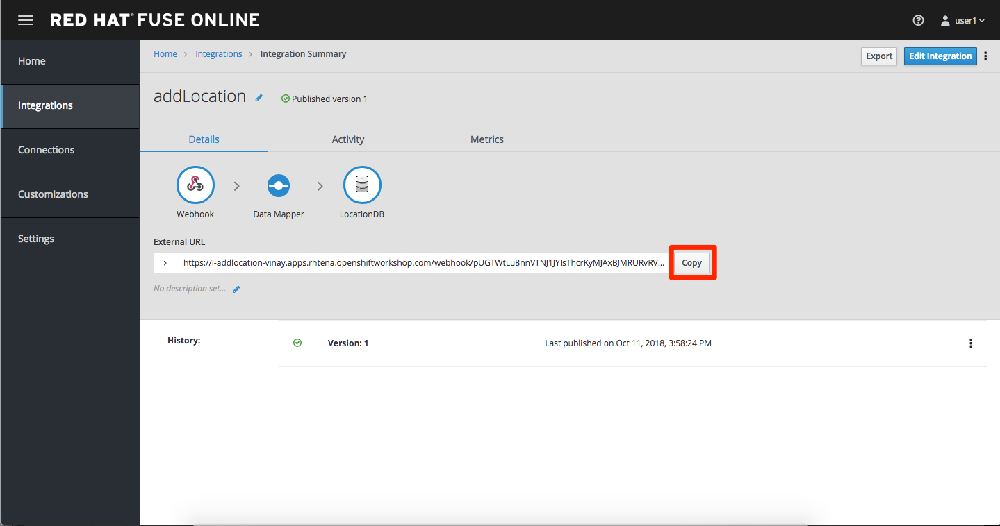
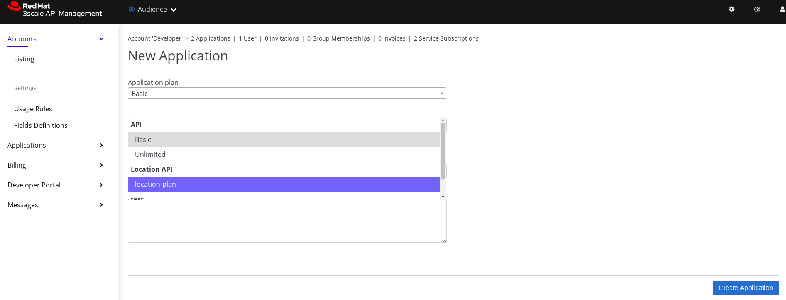
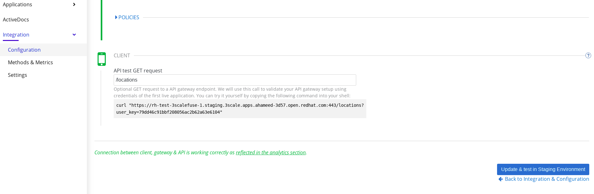

:walkthrough: Integrating API using Solution explorer Applications
:fuse-version: 7.4
:fuse-documentation-url: https://access.redhat.com/documentation/en-us/red_hat_fuse/{fuse-version}/
:amq-documentation-url: https://access.redhat.com/documentation/en-us/red_hat_amq/7.4/
:3Scale-ProductName: Red Hat 3scale
:route: https://wt3-{user-username}-3scale.{openshift-app-host}
:sso-realm-url: {user-sso-url}/auth/admin/{user-username}/console/index.html
:sso-adapter-docs-url: https://access.redhat.com/documentation/en-us/red_hat_single_sign-on/7.3/html/securing_applications_and_services_guide/index
:code-ready-service: CodeReady Workspaces
:rhmi-sso-name: Managed Integration SSO instance
:customer-sso-name: End user SSO instance


= {walkthrough}

This Solution Pattern demonstrates how to use solution explorer to design, implement, manage and secure API.

This Solution Pattern consists of the following components:


* Design API , Red Hat's Apicurio and desing the API definition based on the OpenAPI Specification
* Implement the RESTful API, Use Red Hat CodeReady Workspaces.
* Integrate the API, integrate a simple API example with Fuse online
* Manage the API : Use 3scale API Management solution to enables protect and manage the APIs.
* Secure/Consume API : design web-app and secure with Red Hat Single Sign-On


[type=walkthroughResource,serviceName=openshift]
.Red Hat OpenShift
****
* link:{openshift-host}/console[Console, window="_blank"]
* link:https://help.openshift.com/[Openshift Online Help Center, window="_blank"]
* link:https://blog.openshift.com/[Openshift Blog, window="_blank"]
****


[type=walkthroughResource,serviceName=fuse]
.Fuse Online
****
* link:{fuse-url}[Console, window="_blank", id="resources-fuse-url"]
* link:{fuse-documentation-url}[Fuse Documentation, window="_blank"]
****

[type=walkthroughResource,serviceName=amq-online-standard]
.AMQ Online
****
* link:{enmasse-url}[Console, window="_blank", , id="resources-enmasse-url"]
* link:{amq-documentation-url}[AMQ Documentation, window="_blank"]
****


[type=walkthroughResource,serviceName=3scale]
.End user SSO instance
****
* link:{sso-realm-url}[SSO Realm Console, window="_blank"]
* link:https://access.redhat.com/products/red-hat-single-sign-on/[Red Hat Single Sign-On Overview, window="_blank"]
****


[type=walkthroughResource,serviceName=codeready]
.CodeReady Workspaces
****
* link:{che-url}[Console, window="_blank"]
* link:https://developers.redhat.com/products/codeready-workspaces/overview/[{code-ready-service} Overview, window="_blank"]
* link:https://access.redhat.com/documentation/en-us/red_hat_codeready_workspaces/1.2/[{code-ready-service} Documentation, window="_blank"]
****

[type=walkthroughResource,serviceName=3scale]
.3Scale
****
* link:{api-management-url}[Console, window="_blank"]
* link:https://developers.redhat.com/products/3scale/overview/[3Scale Overview, window="_blank"]
* link:https://www.3scale.net[3Scale Website, window="_blank"]
****


[time=15]
== Task Design API with the Apicurio


**Step1.  Importing APIs with Apicurio Studio**


 * Download the API example from

 https://raw.githubusercontent.com/redhatHameed/Solution-Explorer/master/Locations.json

 * Log in to the link:

 * Click on Open API

 * click on Edit API to walk through your newly imported API

 * verify our data definitions for the API. Click on the location/phone{id} link under the Paths

image::images/apicurio-1.png[integration, role="integr8ly-img-responsive"]


 * Notice that this API path has a single path parameter (id defined as an int32) and a single GET operation defined. Click on the GET operation, then click the location drop-down which is part of the 200 OK response


- Verify the location object Click on the </> location object link under the Data Types section. Notice that the object has a bunch of properties defined that make up the object.
   


**Step2 .  Generate the Fuse Project**


- Generate Fuse/Camel Java project by selecting Generate button from Apicurio dashboard and select the Fuse version.  

image::images/apicurio-4.png[integration, role="integr8ly-img-responsive"]


- Download and review the project files and create a new Repo on Github and push the project.


[type=verification]
====
Did it work?
====

[type=verificationFail]
Try the steps again. If it's still not working contact your administrator.


[time=15]
== Implement the API


###  Step 1: Create a code ready environment.

* Log in to the link:{che-url}[{code-ready-service}, window="_blank", id="{context}-4"] Dashboard

* use your unique username as your workspace name.
* Select "Redhat Fuse" stack, increase the RAM to 4GB and then click Create.


image::images/codeready-1.png[integration, role="integr8ly-img-responsive"]


* Click on Create to generate and open the workspace.
* Click on Open in IDE, and then  Click Start


### Step 2: Import the skeleton projects from Git

* assume that you have pushed the generated project into GitHub. completed in Task 1

* Click on Workspace > Import Project from the main menu. A pop-up will appear.

image::images/codeready-2.png[integration, role="integr8ly-img-responsive"]
 

### Step 3: Complete Route implementation


the complete implementation can be find from this link:

   https://github.com/redhatHameed/Solution-Explorer


### Step 5: Create your Openshift project and set up a sample database


* Open Red Hat Openshift link:{openshift-host}/console/project[Red Hat Openshift, window="_blank"] .


* Create your unique namespace

* Click on Catalog on the left menu, then navigate to the Databases menu and select Postgres. From there, select the PostgreSQL (Ephemeral) template.

* the pop-up window that appears, click the Next button to reach the Configuration page.

* Update PostgreSQL Connection Username to dbuser and PostgreSQL Connection Password to password

* Click Next and ensure Do not Bind at this time is selected. Click Create to generate the service.

* update or make sure that the implementation project has the same configuration in the properties file.

image::images/codeready-4.png[integration, role="integr8ly-img-responsive"]


### Step 6: Run and  Deploy the project

* Test the project locally, navigate Manage commands screen, double-click the run:spring-boot script and hit Run. The script will run locally in code ready.
 
* Once SpringBoot has started-up, right-click the dev-machine (under Machines) and select Servers. Click the link corresponding to port 8080. A new tab should open ``/locations`` to the URI

* Next deploy it to our running OpenShift environment
* Navigate back to the OpenShift web UI and click the Copy Login Command link.

image::images/codeready-5.png[integration, role="integr8ly-img-responsive"]


* Navigate back to Code Ready, open the terminal, and paste the login command from your clipboard. Once you've logged in, select the OpenShift project you used earlier using ``oc project <your project name>``

image::images/codeready-6.png[integration, role="integr8ly-img-responsive"]


* To run the fabric8 Maven command to deploy our project, navigate back to the Manage commands screen, double-click the fabric8:deploy script.

 Click Run. The script will run and deploy to your OCPPROJECT.





* verify your service by ``<your openshift url>/locations`` or  can also search for individual locations by adjusting the URI to ``/locations/{id} e.g. /locations/100``


[type=verification]
====
Did it work?
====

[type=verificationFail]
Try the steps again. If it's still not working contact your administrator.

[time=15]
==  Integrate the API


### Step 1: Create database connection


* Log in to the link:{fuse-url}[Red Hat Fuse Online, window="_blank", id="{context}-1"] console.
* Click on **Connections > Create Connection**
* Select **Database**
* Enter below values for Database Configuration

```
Connection URL: jdbc:postgresql://postgresql.OCPPROJECT.svc:5432/sampledb
Username      : dbuser
Password      : password
Schema        : <blank>

```
* Click Validate and verify if the connection is successful. Click Next to proceed.

* Add Connection details: Connection Name: LocationDB and Click Creat

### Step 2:Create webhook integration

* click on Integrations > Create Integration
* Choose Webhook
* Click on Incoming webhook
* It navigates to the Webhook Token screen. Click Next
* Define the Output Data Type.

```
 Select type from the dropdown as JSON instance.
 Enter Data type Name: Custom
 For Definition:, copy below JSON data.
 Click Done
 
 


jason {
  "id": 1,
  "name": "xxx",
  "type": "Regional Branch",
  "status": "1",
  "location": {
    "lat": "-28.32555",
    "lng": "-5.91531"
  }
}
```

* Click on LocationDB from the catalog and then select Invoke SQL

```
INSERT INTO locations (id,name,lat,lng,location_type,status) VALUES (:#id,:#name,:#lat,:#lng,:#location_type,:#status )
```

* Click on Add Step and select Data mapper

* Drag and drop the matching Source Data types to all their corresponding Targets as per the following screenshot. When finished, click Done.


* Click Publish on the next screen and add integration name: addLocation and publish again.

### Step 3: Create a POST request


 * Copy the External URL per the below screenshot



*  Run below the curl command and make sure to use your URL you copied and pasted
 
 
```
 curl -k --header "Content-Type: application/json"
--request POST
--data '{"id": 101, "name": "userxx", "type": "Regional Branch", "status": "1", "location": { "lat": "-28.32555", "lng": "-5.91531" }}'
  https:/<fuse-copied-url>

```

* Click on Activity > Refresh and verify if the new record is created.


[type=verification]
====
Did it work?
====

[type=verificationFail]
Try the steps again. If it's still not working contact your administrator.
[time=15]
==  Manage the API

### Step 1: Create a New API

* Open the link:{api-management-url}[{3Scale-ProductName} Login screen, window="_blank", id="{context}-6"].

* Click on NEW API on 3scale Dashboard


*	Mention the below details:

	Name :Location API
	System Name : location-sso :


* Create Application Plan with name **location-plan**

* add an application to Application Plan by selecting **Accounts** from the dashboard and clicking on **create application**

image::images/3scale-2.png[integration, role="integr8ly-img-responsive"]

* select application plan name from drop-down as **location-plan** and give application name



* Click on **Integration** link and select **Configuration** and then click the link **add the base URL of your API and save the configuration**

image::images/3scale-4.png[integration, role="integr8ly-img-responsive"]


* Add Below details:

   

   Private Base URL* : Route of the location API deployed in openshift project

   API GATEWAY*-( you can get the details from 3scale openshift project by going inside the routes)

   Staging Public Base URL*
   Production Public Base URL* <br>

   API test GET request*   write  ``/locations`` inside the text box.



 

* Click on **Update &amp; test in Staging Environment**

* Test API

  curl "https://rh-test-3scalefuse-1.staging.3scale.apps.ahameed-3d57.open.redhat.com:443/locations?user_key=79dd46c91bbf208056ac2b62a63e6104"


[type=verification]
====
Did it work?
====

[type=verificationFail]
Try the steps again. If it's still not working contact your administrator.